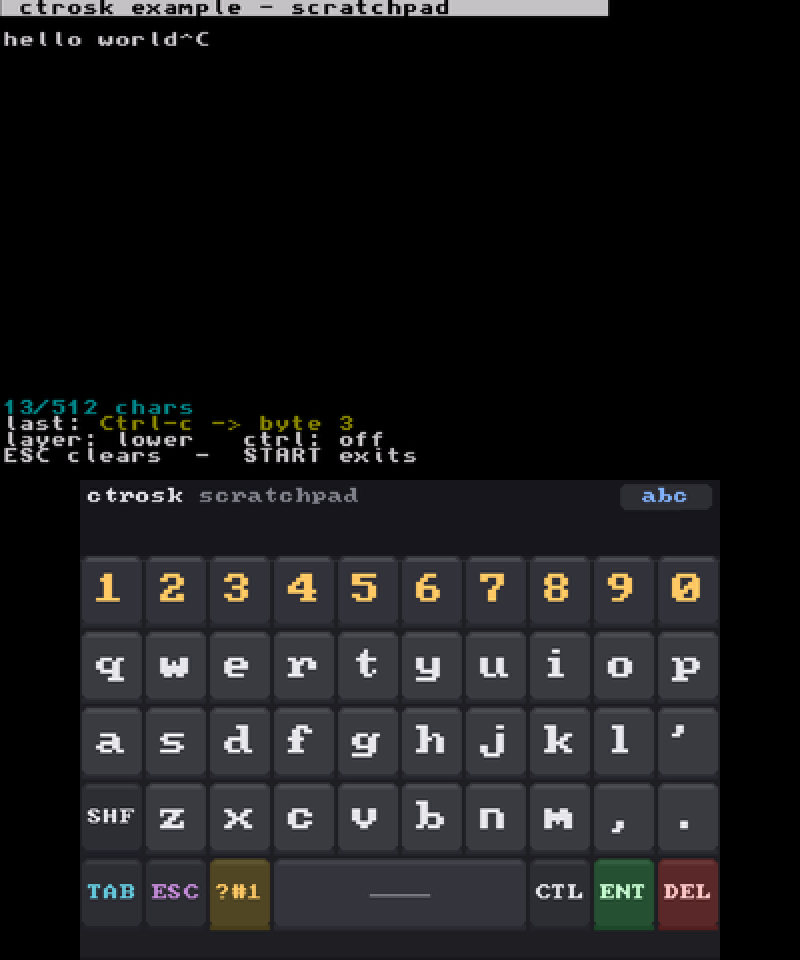

# ctr-osk-rt

A pointer-driven on-screen keyboard for Nintendo homebrew.

A Nintendo console's own software keyboard is (so far) a modal applet: it takes over the
screen, blocks until the user is done, and hands you back a string. That is the
wrong shape for anything interactive. `ctr-osk-rt` is the other shape. It stays
on screen, never blocks, and hands you one key at a time while your app keeps
running and keeps drawing.

It knows nothing about any console. You give it a framebuffer to draw into and
the pointer position for this frame; it gives you keypresses. It started on the
3DS, hence the name, and now also runs on the Wii U, Switch, Wii and GameCube.



That is `example/`, built by `make example` below. Every key you press shows up
in the buffer on the top screen next to the raw event it produced, which is the
quickest way to see what the library actually hands back - `Ctrl-c` above
reports the letter and the folded control byte together.

- 5x10 grid, four layers: lowercase, uppercase, and two symbol layers.
- CTRL modifiers
- Tab, Esc, Enter and Backspace
- Draws into a framebuffer you describe, so it is not tied to one console:
  rotated or linear, 24 or 32 bits per pixel, either byte order.
- Drivable by touch, by a pointer, or by d-pad focus where there is neither.
- Fully themeable, and you can replace the layout tables

## Building

The library is plain C99 with no dependencies: two source files and a header,
which most projects will just compile alongside their own sources. The
Makefile here builds it for the 3DS, and the example with it, so it needs
devkitPro with devkitARM and libctru.

```sh
make                  # lib/libctrosk.a
make example          # example/ctrosk-example.3dsx
sudo -E make install  # into $PORTLIBS, so other projects can just -lctrosk
```

To use it without installing, point your app's `LIBDIRS` at this directory and
add `-lctrosk` to `LIBS` - that is exactly what `example/Makefile` does.

For another console, compile `source/*.c` with `include/` on the include path
and fill in a `CtrOskSurface` for its framebuffer. Nothing else is needed.

## Quick start

```c
#include <3ds.h>
#include <ctrosk.h>

int main(void) {
  gfxInitDefault();
  consoleInit(GFX_TOP, NULL);
  gfxSetDoubleBuffering(GFX_BOTTOM, false);   /* it redraws in place */

  CtrOsk osk;
  ctrOskInit(&osk);
  osk.title = "my app";

  while (aptMainLoop()) {
    hidScanInput();
    if (hidKeysDown() & KEY_START) break;

    touchPosition tp;
    hidTouchRead(&tp);
    CtrOskPointer ptr = { tp.px, tp.py, (hidKeysHeld() & KEY_TOUCH) != 0 };

    CtrOskEvent ev;
    if (ctrOskUpdate(&osk, &ptr, &ev) && ev.byte >= 32 && ev.byte <= 126)
      putchar(ev.byte);

    /* The bottom screen is rotated: a column is contiguous and y runs
       backwards, which is what the strides say. */
    u8 *fb = gfxGetFramebuffer(GFX_BOTTOM, GFX_LEFT, NULL, NULL);
    CtrOskSurface dst = { fb + (240 - 1) * 3, 320, 240, 240 * 3, -3, 0 };
    ctrOskDraw(&osk, &dst);

    gfxFlushBuffers();
    gfxSwapBuffers();
    gspWaitForVBlank();
  }

  gfxExit();
}
```

The quick start above is the 3DS, which is the awkward case worth showing: its
framebuffer is rotated, so a column is contiguous and `y_stride` is negative.
A linear 32bpp screen is just `{fb, w, h, 4, w * 4, 1}`.

Where there is no pointer at all, drive the grid with `ctrOskMoveFocus` and
commit with `ctrOskActivate`; they walk and press the same cell the pointer
path would highlight.

If you draw over the keyboard's area yourself, call `ctrOskInvalidate` so the
next `ctrOskDraw` repaints rather than assuming it is still intact.

## License

GPL-3.0. See [LICENSE](LICENSE).
